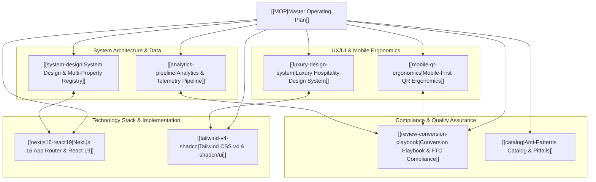

# Master Operating Plan & Knowledge Graph (MOP)
### Sujet Marina Hotel Da Nang By Haviland — Hotel Review Hub



---

## 1. Executive Summary & Purpose

The **Hotel Review Hub** (`hotel-review-management`) is a specialized, production-quality, mobile-first guest engagement platform built for **Sujet Marina Hotel Da Nang By Haviland** (Haviland House). 

Deployed seamlessly to **Vercel** with **Next.js 16 (App Router)**, **React 19**, **TypeScript**, and **Tailwind CSS v4**, this application serves as the digital destination for physical QR code interactions located on hotel nightstands, checkout folios, keycard sleeves, and concierge counters.

---

## 2. Knowledge Graph Index (WikiLinks)

Each node in this knowledge base possesses a dedicated zone of responsibility:

| Knowledge Module | Scope & Zone of Responsibility | Core Document |
| :--- | :--- | :--- |
| **System Architecture** | Multi-hotel configuration registry (`src/config/hotels.ts`), multi-tenant routing, decoupled contracts, link safety. | [[system-design]] |
| **Analytics Pipeline** | Pluggable telemetry abstraction (`src/lib/analytics.ts`), QR touchpoint attribution, beacon non-blocking dispatch. | [[analytics-pipeline]] |
| **Luxury Design System** | Boutique hospitality visual tokens, dark obsidian/brushed champagne palette, typography, anti-SaaS principles. | [[luxury-design-system]] |
| **Mobile QR Ergonomics** | Thumb-zone reachability, touch target dimensions (>56px), sub-second FCP/LCP speed budget, PWA manifest caching. | [[mobile-qr-ergonomics]] |
| **Next.js 16 & React 19** | RSC boundaries, React Compiler automatic memoization, metadata/OpenGraph generation, Vercel edge deployment. | [[nextjs16-react19]] |
| **Tailwind v4 & shadcn/ui** | Tailwind v4 `@theme` directives, Radix UI accessibility primitives, glassmorphic utility layers, high-res brand SVGs. | [[tailwind-v4-shadcn]] |
| **Conversion Playbook** | Physical touchpoint matrix, scan-to-review psychology, deep link URL schemas, FTC 16 CFR Part 465 compliance. | [[review-conversion-playbook]] |
| **Anti-Patterns Catalog** | Comprehensive inventory of architectural, visual, and regulatory anti-patterns with explicit remediations. | [[catalog]] |

---

## 3. Directory Blueprint & Module Zones of Responsibility

```text
hotel-review-management/
├── .mind/                                  # Graph-based architectural knowledge repository
│   ├── MOP.md                              # Master operating plan & index (this file)
│   ├── architecture/
│   │   ├── system-design.md                # [[system-design]] Multi-property config & contracts
│   │   └── analytics-pipeline.md           # [[analytics-pipeline]] Telemetry & event dispatching
│   ├── ui-ux/
│   │   ├── luxury-design-system.md         # [[luxury-design-system]] Aesthetic tokens & styling
│   │   └── mobile-qr-ergonomics.md         # [[mobile-qr-ergonomics]] Mobile viewport & performance
│   ├── stack/
│   │   ├── nextjs16-react19.md             # [[nextjs16-react19]] App Router, RSC & Compiler
│   │   └── tailwind-v4-shadcn.md           # [[tailwind-v4-shadcn]] Tailwind v4 & shadcn primitives
│   ├── compliance-growth/
│   │   └── review-conversion-playbook.md   # [[review-conversion-playbook]] Conversion & FTC rules
│   └── antipatterns/
│       └── catalog.md                      # [[catalog]] Anti-patterns & architectural traps
│
├── src/
│   ├── app/
│   │   ├── layout.tsx                      # Root RSC layout with Google fonts, viewport, and OpenGraph
│   │   ├── page.tsx                        # Server-rendered review hub page for Sujet Marina
│   │   ├── globals.css                     # Tailwind v4 engine & bespoke luxury glass utility layers
│   │   ├── manifest.ts                     # PWA web app manifest for QR code caching
│   │   └── icon.tsx                        # Dynamic high-resolution favicon/app icon generator
│   ├── components/
│   │   ├── ui/                             # shadcn atomic UI primitives (button.tsx, card.tsx, etc.)
│   │   ├── HeroSection.tsx                 # Hotel photography, Haviland House branding & badges
│   │   ├── RatingBanner.tsx                # 5-star social proof cluster & guest satisfaction stats
│   │   ├── ReviewCard.tsx                  # Interactive platform button with brand icon & telemetry
│   │   ├── PrivateFeedbackCard.tsx         # FTC-compliant direct manager/concierge contact fallback
│   │   └── Footer.tsx                      # Official domain link & copyright accreditation
│   ├── config/
│   │   └── hotels.ts                       # Typed multi-hotel registry and platform deep link schemas
│   └── lib/
│       ├── analytics.ts                    # Modular event tracking abstraction (GA4, Vercel, Beacon)
│       └── utils.ts                        # Tailwind class merge utility (cn)
│
├── AGENTS.md                               # Project blueprint & engineering standards
└── package.json                            # Package specifications (Next.js 16, React 19, Tailwind v4)
```

---

## 4. Key Architectural Decisions Summary

1. **Zero Hardcoded Endpoints**: All platform links, ratings, titles, and property metadata live in `src/config/hotels.ts` (`[[system-design]]`).
2. **True RSC Hydration Efficiency**: Initial page render requires 0ms hydration blocking because hero imagery, static copy, and layout are Server Components (`[[nextjs16-react19]]`).
3. **Boutique Luxury Hospitality Aesthetics**: Eliminates generic SaaS dashboard look in favor of an obsidian, champagne-gold, and frosted glass aesthetic (`[[luxury-design-system]]`).
4. **FTC 16 CFR Part 465 Full Compliance**: Universal, non-gated review access ensures strict adherence to international review honesty laws while offering a direct concierge fallback (`[[review-conversion-playbook]]`).
5. **Robust Non-Blocking Telemetry**: Beacon and async dispatch guarantee telemetry capture without impeding external navigation (`[[analytics-pipeline]]`).

---
*Generated with cross-verified documentation via Context7, Exa Research, and Next.js DevTools.*
