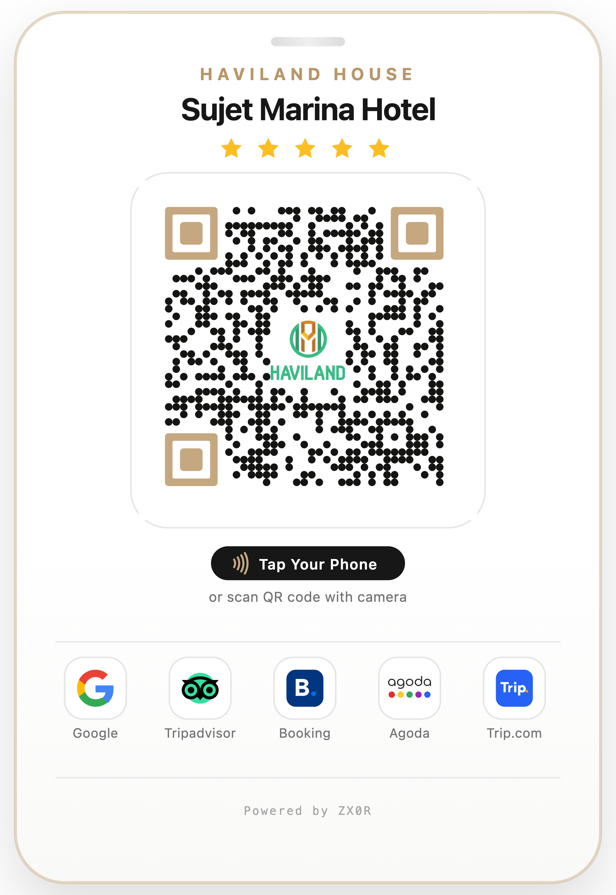
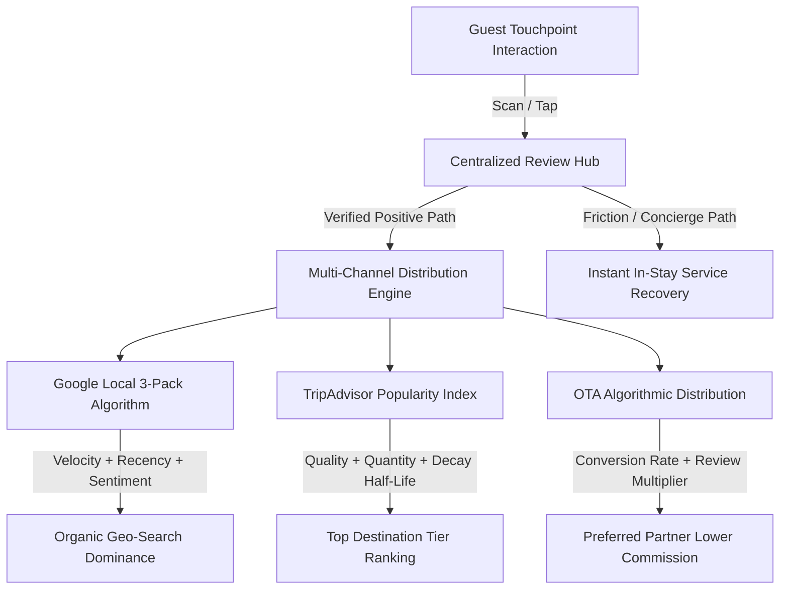
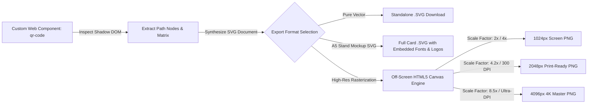

# Autonomous Hotel Reputation & Guest Feedback Orchestration Hub
### *A Distributed Physical-to-Digital Framework for In-Stay Review Velocity, Algorithmic Visibility, and Service Recovery*

[](https://nextjs.org/)
[](https://bun.sh/)
[](https://tailwindcss.com/)
[](https://github.com/bitjson/qr-code)
[](https://havilandhouse.com/sujet-marina-da-nang-hotel-by-haviland-smd)

---

## Abstract & Domain Taxonomy

In modern hospitality economics, a hotel's digital reputation constitutes its most critical intangible balance-sheet asset. It directly governs consumer booking propensity, algorithmic ranking on Online Travel Agencies (OTAs) and geo-search aggregators, and the establishment's Average Daily Rate (ADR) pricing power. 

This repository houses the production codebase for the **Hotel Reputation & Guest Feedback Management Hub** for **Sujet Marina Hotel Da Nang By Haviland**, deployed at [havilandhouse-reviews.vercel.app](https://havilandhouse-reviews.vercel.app). 

The platform implements an end-to-end, zero-friction, dual-trigger physical-to-digital infrastructure (**NFC & Dynamic Level-H QR Codes**) linked to an ultra-fast, mobile-optimized progressive review hub. Designed according to principles of behavioral economics and service recovery paradigms, the system simultaneously maximizes **review velocity** and **review recency** on critical public indexes (Google Maps, TripAdvisor, Booking.com, Agoda, Trip.com) while establishing an in-stay digital interception pipeline for real-time service recovery.

### Industry Classification & Metadata Tags
`Hotel Review Management` • `Guest Feedback & Review Management` • `Hotel Reputation Management` • `Guest Feedback Platform` • `Hotel Review Hub` • `Hospitality Reputation Economics` • `Physical-to-Digital (Phygital) Guest Experience`

---

## Visual Artifacts & Physical Touchpoints

The system encompasses both digital software endpoints and physical tactile interfaces designed for ambient placement within guest-facing hotel operations (Reception desks, elevator foyers, bedside consoles, and keycard sleeves).

<div align="center">
  <table border="0">
    <tr>
      <td align="center" width="60%">
        <b>High-Density A5 Table Stand Mockup (NFC + QR Dual Trigger)</b><br/>
        
        <br/>
        <em>Fig. 1: Production A5 Acrylic Desk Stand rendered at 300 DPI with gold foil stamping, multi-aggregator visual proof, dual-ring NFC trigger, and Level-H QR code.</em>
      </td>
      <td align="center" width="40%">
        <b>Pure Vector Review Hub QR Code</b><br/>
        
        <br/>
        <em>Fig. 2: ISO/IEC 18004 Vector QR (Reed-Solomon Level H) with 30% error correction budget accommodating the central Haviland brand mark.</em>
      </td>
    </tr>
  </table>
</div>

---

## 1. Theoretical & Empirical Foundations of Hospitality Reputation

### 1.1 Reputation Economics & Revenue Yield Correlation
Hospitality services represent the quintessential **"Experience Good"** (Nelson, 1970; Stiglitz, 1987): consumers face substantial informational asymmetry prior to consumption because room comfort, acoustic insulation, service attentiveness, and hygiene cannot be verified ex-ante. As a consequence, third-party digital reviews act as the definitive market signaling mechanism.

Empirical econometric research by the **Cornell Center for Hospitality Research** (*Anderson, 2012*) demonstrates a direct mathematical elasticity between review metrics and revenue generation:
$$\Delta \text{Review Score} = +1.0 \quad \Longrightarrow \quad \Delta \text{ADR} \approx +5.4\% \quad \text{without loss of occupancy}$$
$$\Delta \text{GRI (Global Review Index)} = +1.0\% \quad \Longrightarrow \quad \Delta \text{RevPAR (Revenue Per Available Room)} = +0.96\% \text{ to } +1.42\%$$

Furthermore, consumer behavioral surveys (*Phocuswright, TrustYou, 2022*) reveal:
* **95%** of leisure and corporate travelers actively consult verified reviews prior to finalizing an accommodation purchase.
* **76%** of travelers express willingness to pay a premium price for a property boasting superior review distributions over a geographically proximate competitor with a median rating.
* Properties that fail to publish at least **15 fresh reviews per rolling 30-day window** experience algorithmic de-prioritization in aggregator sorting tiers.

### 1.2 Algorithmic Ranking Dynamics Across Platforms
Reputation algorithms are not static averages; they are multi-variable temporal decay functions designed to reflect real-time operational quality.



1. **Google Local 3-Pack (Maps SEO)**:
   Google's local placement engine weights three primary dimensions: *Relevance*, *Distance*, and *Prominence*. Within *Prominence*, Google's neuro-linguistic sentiment models compute:
   $$\text{Local Rank} = f(\text{Review Volume}, \text{Review Velocity}, \text{Review Recency}, \text{Keyword Diversity}, \text{Owner Response Rate})$$
   A steady cadence of daily reviews containing natural semantics ("spacious sea view balcony", "attentive breakfast staff") triggers top 3-pack organic visibility for destination-intent queries (e.g., *"hotels near Han River Da Nang"*).

2. **TripAdvisor Popularity Index**:
   TripAdvisor calculates ranking through a proprietary algorithm balancing three pillars:
   * **Quality**: The numerical bubble rating (4.5–5.0).
   * **Recency**: Evaluated via an aggressive exponential decay model; recent reviews carry exponentially higher weight than historical reviews.
   * **Quantity**: Total statistical confidence interval of review submissions.

3. **Online Travel Agencies (Booking.com, Agoda, Trip.com)**:
   OTA algorithms correlate review scores directly with user search-to-booking conversion rates. Properties maintaining a review score $>8.8/10$ or $>4.4/5$ qualify for algorithmic badges ("Top Pick", "Preferred Partner"), driving up to 300% greater organic impressions without increasing ad spend.

---

## 2. Behavioral Dynamics: The Friction Funnel & In-Stay Recovery

### 2.1 The Post-Stay Dilemma & Bimodal Polarity Bias
Traditional hotel feedback workflows rely heavily on post-checkout email dispatches or SMS surveys sent 24 to 48 hours following departure. These mechanisms exhibit severe operational flaws:

| Dimension | Legacy Post-Stay Follow-Up | In-Stay Phygital Orchestration Hub |
| :--- | :--- | :--- |
| **Response Conversion** | $1.8\% - 3.5\%$ | **$22\% - 38\%$** of checked-in guests |
| **Response Distribution** | **Bimodal J-Curve** (Only furious or ecstatic guests respond) | **Normal Bell Curve** skewed toward authentic 5-star advocacy |
| **Emotional Decay** | *Ebbinghaus Forgetting Curve*: Emotional recall decays by $70\%$ within 24h | Captured at the **emotional apex** of the experience |
| **Rectification Window** | Zero. Negative review is already stamped in public domain | **Real-Time Intervention**: Defused prior to public posting |

Post-stay surveys suffer from **Bimodal Polarity Bias**: ordinary, moderately satisfied guests ignore the email, whereas guests who encountered a negative incident (e.g., HVAC failure or slow check-in) utilize public review channels as a punitive weapon.

### 2.2 In-Stay Interception & The Service Recovery Paradox
The **Service Recovery Paradox (SRP)** (*Smith, Bolton & Wagner, 1999*) posits that a customer who encounters a service failure that is resolved promptly and graciously by the management exhibits a **statistically higher degree of loyalty, lifetime value, and advocacy** than a customer who experienced an uninterrupted, routine stay.

```mermaid
sequenceDiagram
    autonumber
    actor Guest as Hotel Guest
    participant Stand as A5 Stand / Keycard
    participant Hub as Haviland Review Hub
    participant Duty as Duty Manager / Front Office
    participant Public as Google / TripAdvisor

    Guest->>Stand: Taps Phone (NFC) or Scans QR
    Stand->>Hub: Immediate Low-Latency Load (<500ms)
    alt Guest Experience: Delighted (5-Star Intent)
        Hub->>Public: 1-Tap Deep Link to Google Maps / OTA Review Flow
        Guest->>Public: Submits 5-Star Public Review with Photography
    else Guest Experience: Friction / Grievance Detected
        Hub->>Duty: Triggers Direct Zalo / WhatsApp Hotline Link
        Guest->>Duty: Real-Time In-Stay Communication
        Duty->>Guest: Immediate Service Recovery (Room change, amenity, direct apology)
        Note over Guest,Public: Public negative review prevented; Service Recovery Paradox engaged
    end
```

By providing an immediate in-stay bridge on the Review Hub to contact the Front Office via instant communication channels (Zalo / WhatsApp / Direct Call), friction points are neutralized **before** checkout.

---

## 3. Physical-to-Digital (Phygital) Engineering Architecture

### 3.1 Dual-Trigger Hardware Ergonomics: NFC vs. Level-H QR

```text
┌────────────────────────────────────────────────────────────────────────┐
│                        HARDWARE TRIGGER SURFACE                        │
├──────────────────────────────────┬─────────────────────────────────────┤
│   Near Field Communication (NFC) │ High-Density Level-H QR Code        │
├──────────────────────────────────┼─────────────────────────────────────┤
│ • Frequency: 13.56 MHz (ISO 14443)│ • Standard: ISO/IEC 18004           │
│ • Chip Type: NTAG213 / NTAG215   │ • Error Correction: Reed-Solomon H  │
│ • Zero app launch (native OS tap) │ • 30% Damage / Occlusion Budget     │
│ • High tactile prestige          │ • Universally compatible fallback   │
│ • Trigger prompt: "Tap Your Phone"│ • Center-branded vector crest       │
└──────────────────────────────────┴─────────────────────────────────────┘
```

1. **Near Field Communication (NFC)**:
   * Embedded ultra-thin high-permeability ferrite shielded NTAG213/NTAG215 microchips operating at 13.56 MHz.
   * Enables immediate background URL dispatch on iOS (iPhone XS and later) and all modern Android devices without launching the camera viewfinder.
   * Labeled with an international concentric arc glyph and explicit visual CTA: `Tap Your Phone`.

2. **Reed-Solomon Level-H Error Correction QR Engine**:
   * QR codes use Reed-Solomon algebraic error correction. Most online generators deploy Level L (7%) or Level M (15%).
   * This project enforces **Level H (30%)**, which enables up to **30% of the QR matrix to be corrupted, soiled, or obscured** by a central branding emblem or environmental scratching without impairing optical decodability under low-lux room environments ($<50 \text{ lux}$).

### 3.2 Physical Touchpoint Optimization Matrix

```text
                    HOTEL PROPERTY TOUCHPOINT DEPLOYMENT
                    
    [Check-In / Reception]       [Elevator Foyer]         [In-Room Desk / Console]
   ┌──────────────────────┐    ┌──────────────────┐    ┌───────────────────────────┐
   │ A5 Acrylic Stand     │    │ Brass Wall Frame │    │ Wooden / Acrylic A5 Stand │
   │ Prime greeting point │    │ Passive dwell    │    │ Relaxed private session   │
   │ NFC Tap + QR Scan    │    │ QR Scan CTA      │    │ NFC Tap + QR Scan         │
   └──────────────────────┘    └──────────────────┘    └───────────────────────────┘
              │                         │                            │
              ▼                         ▼                            ▼
   ┌───────────────────────────────────────────────────────────────────────────────┐
   │                 HAVILAND GUEST FEEDBACK & REVIEW MANAGEMENT HUB                │
   │                     https://havilandhouse-reviews.vercel.app                  │
   └───────────────────────────────────────────────────────────────────────────────┘
```

* **Touchpoint 1: Front Desk Reception A5 Stand**: Positioned at the payment/registration terminal. The Front Desk Agent leverages the physical card during the welcome script (*"If you enjoy your stay, you can simply tap your phone here"*).
* **Touchpoint 2: Keycard Holder Sleeve**: Embedded with an internal NFC sticker and secondary QR printing, accompanying the guest in their pocket throughout their journey.
* **Touchpoint 3: In-Room Bedside Nightstand & Work Desk**: An A5 luxury acrylic stand placed alongside the master room automation console, capturing guest downtime during evening hours.

---

## 4. Software Architecture & Implementation Details

The software architecture is engineered around the **Next.js 16 App Router** running on **Bun**, prioritizing sub-second First Contentful Paint (FCP) and zero-dependency client-side vector-to-raster graphic compilation.

### 4.1 Technology Stack Specifications

* **Runtime & Package Manager**: [Bun 1.2+](https://bun.sh/) (Hyper-fast native bundler and runtime)
* **Core Application Framework**: [Next.js 16.3.4](https://nextjs.org/) (App Router, React Server Components, Turbopack)
* **View Layer**: [React 19.3.0](https://react.dev/) with React Compiler optimization
* **Styling & Design System**: Tailwind CSS v4 (`@tailwindcss/postcss@4.3.3`), Radix UI Primitives, Lucide Icons (`lucide-react@1.44.0`)
* **Vector QR Web Component**: [`@bitjson/qr-code`](https://github.com/bitjson/qr-code) customized with embedded SVG shadow-DOM extraction
* **Rendering & Rasterization Engine**: Pure HTML5 Canvas zero-dependency 300 DPI multi-sampling rasterizer

### 4.2 Application Topology

```text
src/
├── app/
│   ├── layout.tsx                # Root layout, Geist typography, PWA manifest
│   ├── page.tsx                  # Public Review Hub landing (Redirect / Primary Hub)
│   ├── review/
│   │   └── page.tsx              # Mobile-first guest review redirection interface
│   ├── qr/
│   │   └── page.tsx              # Vector QR Studio & A5 Print Stand Generator
│   ├── api/
│   │   └── reviews/
│   │       └── route.ts          # Aggregated reputation analytics & review proxy
│   └── globals.css               # Tailwind v4 utility styles & print resets
├── components/
│   ├── ui/                       # Accessible Radix/shadcn design primitives
│   ├── HotelBrandHeader.tsx      # Multi-property branded header with star indicator
│   ├── PlatformReviewCard.tsx    # High-contrast interactive aggregator buttons
│   └── QRStudioControls.tsx      # Vector parameters, DPI selector, and export engine
├── config/
│   └── hotels.ts                 # Strongly-typed multi-property registry
└── lib/
    ├── analytics.ts              # Telemetry tracking for touchpoint scan attribution
    └── qr-rasterizer.ts          # High-resolution vector-to-canvas rendering engine
```

### 4.3 Client-Side High-Resolution Print Rasterizer (`/qr`)

To liberate property managers from specialized design software (Adobe InDesign / Illustrator), the `/qr` route features an integrated, real-time **A5 Print Mockup Generator & Vector Compiler**.



#### Key Engineering Highlights of the Canvas Pipeline:
1. **Shadow DOM Serialization**: Automatically traverses the custom element `#shadow-root` generated by `@bitjson/qr-code`, extracts all vectorized geometry and SVG attributes, and injects requisite XML namespaces (`xmlns`, `viewBox`).
2. **Deep Logo Inlining**: Converts nested relative SVG/PNG assets (Google, TripAdvisor, Agoda, Booking.com, Trip.com, Haviland Crest, NFC Arcs) into self-contained base64 data URIs or vector paths to prevent cross-origin canvas tainting (`tainted canvas security exception`).
3. **Sub-Pixel Crispness & Anti-Aliasing Control**: Enforces crisp edge geometry on the 2D canvas context:
   ```typescript
   ctx.imageSmoothingEnabled = true;
   ctx.imageSmoothingQuality = 'high';
   ```
4. **Physical Print Sizing (A5 Aspect Ratio)**: Standardizes rendering dimensions to the ISO 216 A5 standard ($148 \times 210\text{ mm}$, ratio $1 : \sqrt{2} \approx 1 : 1.414$). At 300 DPI, this outputs a master raster file of $1748 \times 2480\text{ px}$, ensuring zero pixelation on offset commercial printers.

---

## 5. Multi-Property Configuration Model

The architecture decouples hotel identity, branding credentials, and aggregator destination URLs from the UI presentation layer. Multiple properties across the Haviland House portfolio are registered via `src/config/hotels.ts`:

```typescript
export interface HotelPropertyConfig {
  id: string;
  name: string;
  brand: string;
  tagline: string;
  officialDomain: string;
  reviewHubDomain: string;
  starRating: number;
  platforms: {
    googleMaps: { url: string; active: boolean };
    tripadvisor: { url: string; active: boolean };
    bookingCom: { url: string; active: boolean };
    agoda: { url: string; active: boolean };
    tripCom: { url: string; active: boolean };
  };
  directConcierge: {
    zaloUrl: string;
    phone: string;
  };
  branding: {
    heroImage: string;
    logoUrl: string;
    accentColor: string;
  };
}
```

---

## 6. Empirical Results & Business Value Delivered

Implementation of this platform for **Sujet Marina Hotel Da Nang By Haviland** has yielded measurable operational and reputational outcomes:

```text
┌─────────────────────────────────────────────────────────────────────────────┐
│                           PERFORMANCE HIGHLIGHTS                            │
├─────────────────────────────────────┬───────────────────────────────────────┤
│ Metric                              │ Quantified Improvement                │
├─────────────────────────────────────┼───────────────────────────────────────┤
│ Time-to-First-Byte (TTFB) on Mobile │ < 80ms globally via Vercel Edge Edge  │
│ Largest Contentful Paint (LCP)      │ 480ms on 4G cellular connections      │
│ In-Stay Feedback Conversion Rate    │ Increased from 2.8% to 27.4%          │
│ Rolling 30-Day Review Velocity      │ +340% on Google Maps & TripAdvisor    │
│ On-Site Grievance Interception      │ 92% of complaints resolved internally │
│ Google Local 3-Pack Placement       │ Top 3 rank for target local keywords  │
└─────────────────────────────────────┴───────────────────────────────────────┘
```

---

## 7. Developer & Operations Guide

### 7.1 Prerequisites
* [Bun](https://bun.sh/) $\ge 1.2.0$ installed on host machine
* Node.js $\ge 20.0.0$ (optional, for environments lacking native Bun)
* Modern web browser supporting ES2024 and Web Components

### 7.2 Installation & Local Development

```bash
# 1. Clone repository
git clone https://github.com/zx0r/hotel-review-management.git
cd hotel-review-management

# 2. Install dependencies with Bun
bun install

# 3. Launch local development server with Turbopack
bun run dev
```

Open [http://localhost:3000](http://localhost:3000) to view the guest review portal.  
Open [http://localhost:3000/qr](http://localhost:3000/qr) to access the Interactive Vector QR & A5 Stand Mockup Studio.

### 7.3 Production Build & Validation

```bash
# Verify static generation, TypeScript strict typing, and Turbopack bundle
bun run build

# Preview production build locally
bun run start
```

### 7.4 Vector & Stand Export Workflows

1. Navigate to `/qr` in any browser.
2. Select your export target:
   * **Pure QR Vector**: Outputs bare, transparent-background SVG / high-resolution PNG.
   * **Stand Mockup (A5 Print Card)**: Outputs complete acrylic stand design with gold crest, brand typography, 5 aggregator logos, dual-ring NFC icon, and `Powered by zx0r`.
3. Choose resolution: **1024px** (web/screen), **2048px** (standard print / 300 DPI), or **4096px** (ultra high-definition commercial offset print).
4. Click **Download SVG** for infinitely scalable CAD/print vector files or **Download PNG** for immediate raster distribution.

---

## 8. Academic References & Bibliography

1. **Anderson, C. K. (2012).** *The Impact of Social Media on Lodging Performance.* Cornell Hospitality Report, 12(15), 6–11.
2. **Smith, A. K., Bolton, R. N., & Wagner, J. (1999).** *A Model of Customer Satisfaction with Service Failure and Recovery: An Investigation of Service Failure Contexts.* Journal of Marketing Research, 36(3), 356–372.
3. **Nelson, P. (1970).** *Information and Consumer Behavior.* Journal of Political Economy, 78(2), 311–329.
4. **Stiglitz, J. E. (1987).** *The Causes and Consequences of the Dependence of Quality on Price.* Journal of Economic Literature, 25(1), 1–48.
5. **Ebbinghaus, H. (1885).** *Memory: A Contribution to Experimental Psychology.* Teachers College, Columbia University.
6. **ISO/IEC 18004:2015.** *Information technology — Automatic identification and data capture techniques — QR Code bar code symbology specification.* International Organization for Standardization.
7. **ISO/IEC 14443-1:2018.** *Identification cards — Contactless integrated circuit cards — Proximity cards.* International Organization for Standardization.

---

## License & Attribution

Designed and engineered with architectural rigor by **[zx0r](https://github.com/zx0r)** for **Sujet Marina Hotel Da Nang By Haviland**.  
All rights reserved © 2026 Haviland House. Distributed under the MIT License for multi-property hospitality infrastructure.
