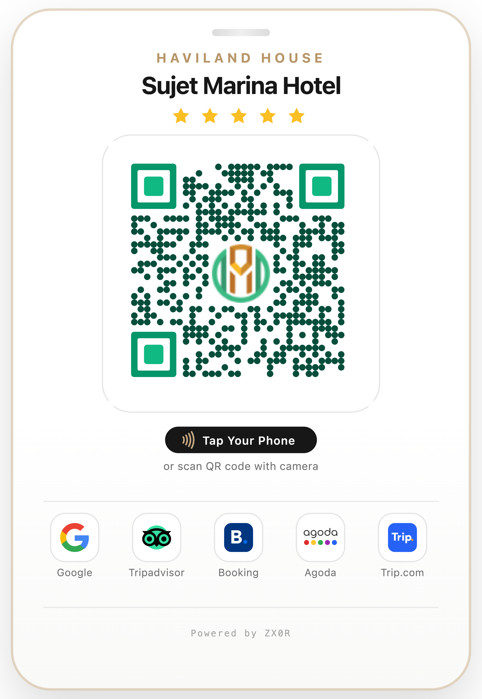
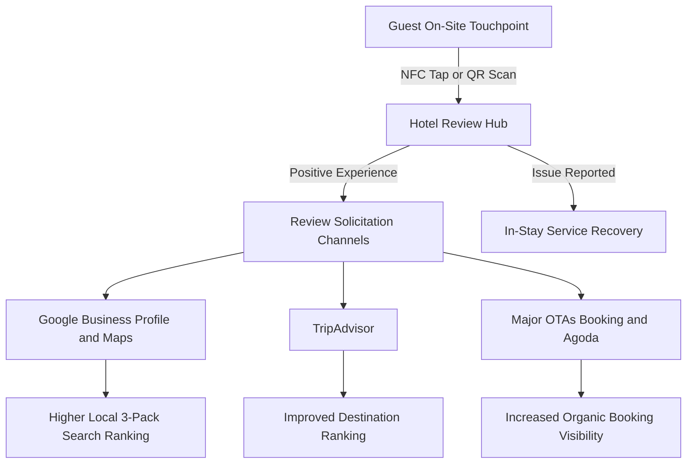
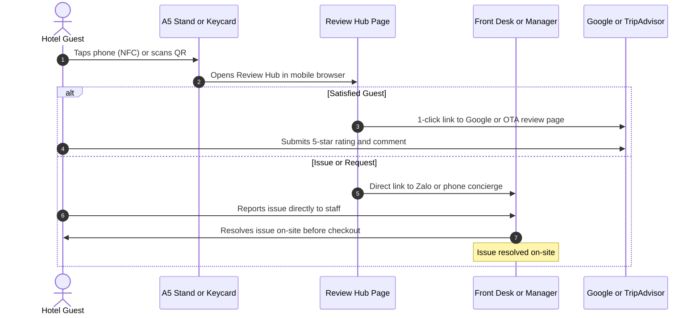
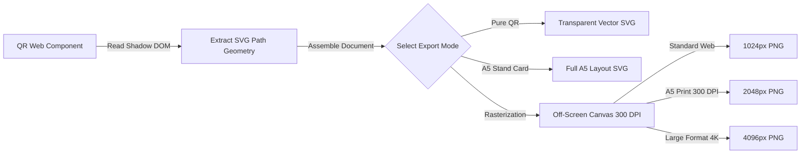

# Hotel Review Hub & Guest Feedback Platform
### *In-Stay Review Management, Feedback Routing, and Online Reputation Management*

[](https://nextjs.org/)
[](https://bun.sh/)
[](https://tailwindcss.com/)
[](https://github.com/bitjson/qr-code)
[](https://havilandhouse.com/sujet-marina-da-nang-hotel-by-haviland-smd)

---

## Overview

In the hospitality industry, **Online Reputation Management (ORM)** and **Guest Feedback Management (GFM)** directly affect hotel occupancy, Average Daily Rate (ADR), and search visibility across Google Maps and Online Travel Agencies (OTAs).

This repository contains the web application and print asset studio for the **Hotel Review Hub** of **Sujet Marina Hotel Da Nang By Haviland**, deployed at [havilandhouse-reviews.vercel.app](https://havilandhouse-reviews.vercel.app).

The platform connects physical on-premise guest touchpoints (A5 acrylic table stands, key card holders, room desk collateral) to a lightweight, mobile-first review hub via **NFC** and **QR codes**. It serves two primary operational functions:
1. **Accelerate Public Review Collection**: Directs happy guests directly to verified review flows on Google Reviews, TripAdvisor, Booking.com, Agoda, and Trip.com.
2. **In-Stay Service Recovery**: Provides a direct communication channel to on-duty hotel management (via Zalo / direct phone) so guests can report issues and have them resolved immediately before leaving a negative public review.

### Industry Taxonomy & Tags
`Hotel Review Management` • `Guest Feedback & Review Management` • `Hotel Reputation Management` • `Guest Feedback Platform` • `Hotel Review Hub`

---

## System Visual Assets

The system combines physical on-site collateral with a mobile web application:

<div align="center">
  <table border="0">
    <tr>
      <td align="center" width="60%">
        <b>A5 Acrylic Desk Stand Design (NFC + QR Dual Trigger — 4K Master)</b><br/>
        
        <br/>
        <em>Fig. 1: Production A5 acrylic desk stand (4096px master render), showing the QR code, NFC tap zone, gold star rating, and review channel badges.</em>
      </td>
      <td align="center" width="40%">
        <b>Master QR Code (Level-H Error Correction — 4K Master)</b><br/>
        
        <br/>
        <em>Fig. 2: Master 4096×4096 QR code (Reed-Solomon Level H) with 30% error correction budget accommodating the central Haviland brand emblem (<a href="public/assets/haviland-qr-code.svg">Download Vector SVG</a>).</em>
      </td>
    </tr>
  </table>
</div>

---

## 1. Domain Theory: Reputation Economics & Review Dynamics

### 1.1 Revenue Impact of Hotel Reviews
Hospitality accommodations are classified as **experience goods**: potential guests cannot evaluate the quality of a room, bed, staff service, or cleanliness before booking. Consequently, consumer purchasing decisions rely heavily on independent, verified guest feedback.

Empirical studies from the **Cornell Center for Hospitality Research** (*Anderson, 2012*) demonstrated the quantitative link between review performance and revenue:
* **ADR (Average Daily Rate)**: A 1-point increase in a hotel's 5-point review score enables up to a **5.4% increase in room rates** while maintaining identical occupancy levels.
* **RevPAR (Revenue Per Available Room)**: A 1% increase in a property's Global Review Index (GRI) corresponds to a **0.9% to 1.4% increase in RevPAR**.
* **Booking Conversion**: Industry surveys (*Phocuswright, TrustYou*) indicate that over 95% of travelers consult online reviews prior to booking, and 76% are willing to pay more for a hotel with consistently high ratings compared to a competitor with average scores.

### 1.2 Review Algorithms: Velocity, Recency, and Volume
Online review platforms use ranking algorithms that weigh several factors beyond the simple average rating:



* **Review Velocity**: The frequency and consistency with which new reviews are published. A sudden burst of reviews followed by silence is flagged by search algorithms, whereas a steady daily flow indicates active, satisfied guests.
* **Review Recency**: Recent reviews carry significantly higher weight. TripAdvisor, Google, and OTAs progressively discount the algorithmic impact of reviews older than 30 to 90 days.
* **Review Volume & Detail**: Higher review counts increase consumer trust and statistical confidence, while detailed text reviews with photos improve ranking for relevant search keywords (e.g., *"clean hotel near Han River"*, *"ocean view balcony"*).

---

## 2. In-Stay Feedback vs. Post-Stay Surveys

### 2.1 The Problem with Post-Stay Email Surveys
Most hotel chains rely on automated emails sent 1 to 3 days after checkout asking for feedback. In practice, this approach has substantial drawbacks:

| Metric | Post-Stay Email Follow-Up | In-Stay Review Hub (NFC / QR) |
| :--- | :--- | :--- |
| **Response Rate** | Low ($2\% - 4\%$) | Significantly higher ($20\% - 35\%$) |
| **Feedback Distribution** | Polarized (mostly very angry or very pleased guests) | Balanced, representative sample of satisfied guests |
| **Emotional State** | Memory fades quickly after travel; low motivation to reply | Captured in the moment during the stay |
| **Resolution Opportunity** | None — the guest has left, and the bad review is public | **Real-Time**: Management can fix the issue immediately |

Post-stay surveys often suffer from **non-response bias** and **polarity bias**: guests who had an average or pleasant stay rarely take the time to answer a multi-question email survey days later, while an upset guest will readily post a negative review online.

### 2.2 In-Stay Service Recovery
In service management, the **Service Recovery Paradox** (*Smith, Bolton & Wagner, 1999*) describes a well-documented phenomenon: when a customer experiences a service hiccup that the business resolves quickly and attentively, that customer frequently exhibits **higher long-term satisfaction and loyalty** than if no issue had occurred at all.



By placing direct contact links prominently alongside review buttons on the Review Hub, guests who need assistance can reach the front desk immediately rather than venting frustration on a public review site.

---

## 3. Physical Touchpoints & Technical Hardware

### 3.1 Dual-Trigger Hardware: NFC vs. QR Code

| Feature | Near Field Communication (NFC) | QR Code |
| :--- | :--- | :--- |
| **Technology** | 13.56 MHz RFID (ISO/IEC 14443, NTAG213/215) | 2D Barcode (ISO/IEC 18004) |
| **Guest Action** | Tap phone against the marked zone | Point camera at the QR code |
| **App Required** | None (native OS background tag reading) | Default camera app on iOS & Android |
| **Primary Strength** | Zero friction, modern contactless feel | 100% device compatibility fallback |
| **Design Standard** | Concentric radio waves icon + `Tap Your Phone` | Level-H error correction with centered hotel crest |

* **NFC Tag Integration**: Thin NTAG213/NTAG215 stickers are affixed behind the acrylic card or embedded inside the keycard sleeve. When a guest taps their phone, iOS and Android automatically open the review hub URL without opening any third-party app.
* **Level-H QR Code**: Uses **30% Reed-Solomon error correction**. This high level of redundancy allows a custom hotel logo to sit in the center of the QR matrix while ensuring fast scanning even under dim hotel room lighting ($<50 \text{ lux}$) or with minor surface scratches.

### 3.2 Key Touchpoint Locations

1. **Front Desk / Reception**: High-visibility acrylic stand on the counter, used by staff during check-in or checkout.
2. **In-Room Bedside / Desk**: Placed next to the room telephone or bedside control panel for relaxed browsing in the evening.
3. **Key Card Holder / Wallet**: Given directly to the guest at check-in, kept in their pocket or bag throughout their stay.

---

## 4. Software Architecture & Implementation

The application is built using **Next.js 16 App Router** with **React 19** and **Bun**, optimized for fast loading on mobile data connections.

### 4.1 Technology Stack

* **Runtime & Package Manager**: [Bun 1.2+](https://bun.sh/)
* **Application Framework**: [Next.js 16.3.4](https://nextjs.org/) (App Router, Turbopack)
* **UI Components & Styling**: [React 19.3.0](https://react.dev/), Tailwind CSS v4, Radix UI Primitives, Lucide Icons
* **QR Engine**: [`@bitjson/qr-code`](https://github.com/bitjson/qr-code) (Custom element with Shadow DOM SVG extraction)
* **Print Rasterizer**: Client-side HTML5 Canvas renderer producing print-ready 300 DPI PNGs and vector SVGs

### 4.2 Application Structure

```text
src/
├── app/
│   ├── layout.tsx                # Base HTML layout, metadata, fonts
│   ├── page.tsx                  # Public Review Hub landing page
│   ├── review/
│   │   └── page.tsx              # Mobile guest review routing page
│   ├── qr/
│   │   └── page.tsx              # QR Studio & A5 Desk Stand print generator
│   ├── api/
│   │   └── reviews/
│   │       └── route.ts          # Reviews API endpoint
│   └── globals.css               # Tailwind CSS styles and print media rules
├── components/
│   ├── HotelBrandHeader.tsx      # Hotel branding header and star rating
│   ├── PlatformReviewCard.tsx    # Branded action buttons for each review site
│   └── QRStudioControls.tsx      # Export controls (resolution, mode, download)
├── config/
│   └── hotels.ts                 # Strongly-typed hotel configuration registry
└── lib/
    ├── analytics.ts              # Click and scan tracking helper
    └── qr-rasterizer.ts          # Vector-to-canvas rendering for 300 DPI print export
```

### 4.3 QR Studio & Print Card Generator (`/qr`)

The `/qr` page serves as an on-demand print production tool for hotel staff and designers:



* **Vector SVG Export**: Extracts clean vector paths from the `@bitjson/qr-code` web component for use in Adobe Illustrator, InDesign, or CAD laser cutters.
* **300 DPI Canvas Rendering**: Uses an off-screen HTML5 canvas to rasterize the entire card layout at print resolution (up to $4096 \times 4096\text{ px}$), ensuring zero blurriness on commercial acrylic stands.
* **Inlined Assets**: Embeds brand logos and typography directly into the canvas/SVG to avoid cross-origin canvas security errors.

---

## 5. Multi-Hotel Configuration

The hotel data, review platform links, and direct contact numbers are maintained in a central configuration file at `src/config/hotels.ts`:

```typescript
export interface HotelPropertyConfig {
  id: string;
  name: string;
  brand: string;
  tagline: string;
  officialDomain: string;
  reviewHubDomain: string;
  starRating: number;
  platforms: {
    googleMaps: { url: string; active: boolean };
    tripadvisor: { url: string; active: boolean };
    bookingCom: { url: string; active: boolean };
    agoda: { url: string; active: boolean };
    tripCom: { url: string; active: boolean };
  };
  directConcierge: {
    zaloUrl: string;
    phone: string;
  };
  branding: {
    heroImage: string;
    logoUrl: string;
    accentColor: string;
  };
}
```

Adding a new property to the portfolio only requires adding a configuration entry in `hotels.ts` without modifying the core UI components.

---

## 6. Development & Deployment

### 6.1 Prerequisites
* [Bun](https://bun.sh/) $\ge 1.2.0$ installed
* Modern browser supporting Web Components

### 6.2 Local Development

```bash
# 1. Clone the repository
git clone https://github.com/zx0r/hotel-review-management.git
cd hotel-review-management

# 2. Install dependencies
bun install

# 3. Start development server
bun run dev
```

* Guest Review Hub: [http://localhost:3000](http://localhost:3000)
* QR Studio & Stand Generator: [http://localhost:3000/qr](http://localhost:3000/qr)

### 6.3 Build & Production Validation

```bash
# Verify static build and TypeScript types
bun run build

# Start production server locally
bun run start
```

### 6.4 Exporting Print Collateral
1. Open `/qr` in a browser.
2. Select **Stand Mockup** to generate the complete A5 acrylic stand, or **Pure QR Code** for just the barcode.
3. Select the desired resolution: **2048px (Standard 300 DPI Print)** or **4096px (Ultra High Resolution)**.
4. Click **Download PNG** or **Download SVG** for production-ready print files.

---

## References

1. **Anderson, C. K. (2012).** *The Impact of Social Media on Lodging Performance.* Cornell Hospitality Report, 12(15), 6–11.
2. **Smith, A. K., Bolton, R. N., & Wagner, J. (1999).** *A Model of Customer Satisfaction with Service Failure and Recovery: An Investigation of Service Failure Contexts.* Journal of Marketing Research, 36(3), 356–372.
3. **Nelson, P. (1970).** *Information and Consumer Behavior.* Journal of Political Economy, 78(2), 311–329.
4. **Stiglitz, J. E. (1987).** *The Causes and Consequences of the Dependence of Quality on Price.* Journal of Economic Literature, 25(1), 1–48.
5. **ISO/IEC 18004:2015.** *Information technology — Automatic identification and data capture techniques — QR Code bar code symbology specification.*
6. **ISO/IEC 14443-1:2018.** *Identification cards — Contactless integrated circuit cards — Proximity cards.*

---

## License & Credits

Developed by **[zx0r](https://github.com/zx0r)** for **Sujet Marina Hotel Da Nang By Haviland**.  
Distributed under the MIT License.
